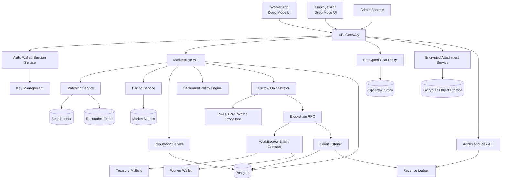

# WORKMESH MVP Architecture

## Architecture Goals

- Keep the marketplace fast and legible while sensitive user data remains encrypted.
- Use smart contracts for escrow settlement and fee routing, not for every product decision.
- Keep compliance controls configurable by jurisdiction, category, and payment rail.
- Make admin revenue and risk observable from both application events and chain events.
- Default every account to pseudonymous public identity, encrypted private content, selective disclosure, minimal metadata retention, and no plaintext server storage for private content.

## System Diagram



## Main Components

| Component | Responsibility | MVP Choice |
| --- | --- | --- |
| Web app | Employer, worker, and admin modes | Single responsive app with role-aware routes |
| API gateway | Auth, rate limits, routing | REST/JSON first, GraphQL optional later |
| Marketplace API | Jobs, offers, applications, statuses | Postgres-backed service |
| Matching service | Ranked recommendations | Deterministic scoring with explainability |
| Pricing service | Suggested rates and fee previews | Formula-based model with category tables |
| Settlement policy engine | Chooses protected payment vs direct-settlement eligibility | Rule-based trust, value, category, remote, and jurisdiction gates |
| Chat relay | Store and forward encrypted messages | Server stores ciphertext only |
| Escrow orchestrator | Prepare transactions and reconcile events | ACH/card/wallet processor plus stablecoin escrow where lawful |
| Event listener | Index chain events | Idempotent worker with replay cursor |
| Revenue ledger | GMV, fees, treasury inflow | Append-only internal accounting table |
| Admin API | Revenue, disputes, fee config, moderation | Role-gated console endpoints |

## Data Flow

1. Employer creates a gig. Private details are encrypted client-side; marketplace discovery receives only minimal matching metadata such as category, approximate zone, budget band, urgency, required level, and skill tags.
2. Pricing service returns suggested pay range, expected platform fee, and employer total.
3. Settlement policy engine decides whether protected payment is required and which rails are available.
4. Matching service ranks available workers and stores match explanations for auditability.
5. Parties negotiate through encrypted chat. Server stores minimal routing metadata and ciphertext.
6. Employer accepts a worker and uses protected payment when required; approved repeat counterparties may use direct settlement.
7. Event listener or processor webhook records funded/released state and posts revenue forecast.
8. On escrow release, contract or payment processor routes worker net and platform fee to the configured treasury/merchant account.
9. Reputation and revenue ledgers update after completion.

## Database Schema Overview

| Table | Key Fields | Notes |
| --- | --- | --- |
| `users` | `id`, `role`, `email_hash`, `wallet_address`, `status`, `created_at` | No plaintext email in analytics exports. |
| `worker_profiles` | `user_id`, `display_name`, `bio_ciphertext`, `skills`, `level`, `service_radius`, `availability` | Public fields separated from encrypted private fields. |
| `employer_profiles` | `user_id`, `company_name`, `industry`, `billing_status`, `kyb_status` | KYB status can be mocked in MVP. |
| `credentials` | `id`, `user_id`, `type`, `issuer`, `status`, `evidence_hash` | Stores hashes/pointers, not raw documents. |
| `jobs` | `id`, `employer_id`, `title`, `category`, `skills`, `location`, `remote`, `budget_min`, `budget_max`, `status`, `encrypted_details_ref`, `public_discovery_metadata` | Private job details are encrypted; discovery fields are intentionally sparse. |
| `job_matches` | `job_id`, `worker_id`, `score`, `score_breakdown`, `status`, `created_at` | Explanation fields support trust and debugging. |
| `offers` | `id`, `job_id`, `worker_id`, `amount`, `deadline`, `status`, `escrow_id` | Accepted offer binds to escrow. |
| `escrows` | `id`, `chain_id`, `contract_address`, `job_hash`, `gross_amount`, `fee_bps`, `treasury`, `state` | Mirrors contract state for UI. |
| `settlement_policies` | `id`, `job_id`, `required_protected_payment`, `allowed_rails`, `direct_settlement_eligible`, `reasons`, `jurisdiction` | Explains payment gating for users and admins. |
| `messages` | `id`, `thread_id`, `sender_id`, `ciphertext`, `nonce`, `key_version`, `created_at` | Body is never plaintext. |
| `attachments` | `id`, `message_id`, `object_uri`, `content_hash`, `ciphertext_key_ref` | Object store contains encrypted bytes. |
| `reviews` | `id`, `job_id`, `reviewer_id`, `subject_id`, `rating`, `tags`, `comment_ciphertext` | Public aggregate, private comment optional. |
| `reputation_events` | `id`, `subject_id`, `event_type`, `weight`, `source_id`, `created_at` | Append-only reputation inputs. |
| `fee_configs` | `id`, `category`, `platform_fee_bps`, `employer_fee_bps`, `worker_fee_bps`, `active_from` | Basis points are versioned. |
| `revenue_ledger` | `id`, `escrow_id`, `gmv`, `platform_fee`, `treasury_tx`, `recognized_at` | Reconciled from chain events. |
| `disputes` | `id`, `job_id`, `opened_by`, `reason`, `state`, `resolution`, `resolver_id` | Evidence references are encrypted. |
| `audit_logs` | `id`, `actor_id`, `action`, `target`, `metadata`, `created_at` | Admin and high-risk actions only. |

## Matching Formula

Scores are normalized to 0-100 and stored with a reason map.

```text
match_score =
  0.28 * skill_fit +
  0.18 * geo_time_fit +
  0.15 * reliability_fit +
  0.12 * price_fit +
  0.10 * reputation_fit +
  0.07 * level_fit +
  0.06 * employer_worker_preference_fit +
  0.04 * freshness
  - risk_penalty
```

Inputs:

- `skill_fit`: weighted overlap of required skills and worker skills, with category-specific synonyms.
- `geo_time_fit`: distance, remote eligibility, schedule overlap, and travel tolerance.
- `reliability_fit`: completion rate, no-show rate, response time, and cancellation recency.
- `price_fit`: worker target rate compared with employer budget and pricing guidance.
- `reputation_fit`: Bayesian average rating with completed-job confidence.
- `level_fit`: worker level suitability for job complexity and escrow amount.
- `employer_worker_preference_fit`: prior successful collaboration, blocked users, saved lists.
- `freshness`: small boost for newly posted jobs and recently active workers.
- `risk_penalty`: unresolved disputes, fraud flags, sanctions/KYC blocks, suspicious velocity.

## Pricing Formula

Suggested pay is formula-based for the MVP and designed to be explainable.

```text
base_hourly = category_base_rate[category][market]

suggested_hourly = clamp(
  base_hourly *
  urgency_multiplier *
  complexity_multiplier *
  level_multiplier *
  reputation_multiplier *
  availability_multiplier,
  worker_floor_rate,
  employer_budget_cap
) + travel_premium

fixed_bid = estimated_hours * suggested_hourly + materials_allowance + risk_buffer

platform_fee = gross_amount * platform_fee_bps / 10000
worker_net = gross_amount - worker_side_fee - agreed_reimbursables_adjustment
employer_total = gross_amount + employer_side_fee + estimated_network_fee
```

MVP defaults:

- Platform fee is configurable per category and stored in `fee_configs`.
- Default investor-demo take rate: 500 bps total.
- Treasury address must be a multisig in non-local environments.
- Pricing explanations show the top three drivers, not the full model internals.

## Payment and Settlement Architecture

WorkMesh supports multi-rail settlement:

- ACH, card, and wallet processor integrations for conventional settlement.
- Stablecoin escrow where lawful and operationally approved.
- Direct settlement only after reputation and risk gates are satisfied.

Protected payment is required for first-time counterparties, high-risk categories, high-value tasks, remote deliverables, low-trust accounts, and restricted jurisdictions. Direct settlement can unlock after positive repeat history, low dispute ratio, strong response behavior, and category approval. Even when direct settlement is allowed, WorkMesh can monetize through verification, priority placement, team tools, compliance services, dispute services, and market intelligence without relying only on transaction fees.

## Smart Contract Overview

`WorkEscrow` stores:

- `jobHash`
- `employer`
- `worker`
- `grossAmount`
- `platformFeeBps`
- `treasury`
- `state`
- `fundedAt`
- `releaseDeadline`

Core methods:

- `fundEscrow(jobHash, worker, feeBps, treasury)`
- `release()`
- `requestRefund()`
- `openDispute(reasonHash)`
- `resolveDispute(workerAmount, employerRefund)`
- `pause()` and `unpause()` for emergency control

Events:

- `EscrowFunded`
- `EscrowReleased`
- `RefundRequested`
- `DisputeOpened`
- `DisputeResolved`
- `PlatformFeePaid`

## Observability

- Product metrics: posted gigs, active workers, match acceptance, time to first match.
- Trust metrics: escrow funded rate, completion rate, dispute rate, cancellation rate.
- Revenue metrics: GMV, fee bps, recognized revenue, treasury inflow, failed release rate.
- Security metrics: auth failures, key rotation, suspicious login, wallet mismatch, flagged messages.
