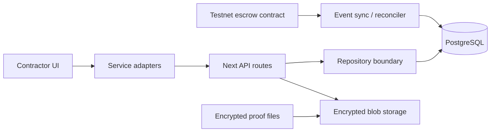

# Relai Infrastructure Plan

## Current Boundary

The approved contractor UI talks to service adapters in `apps/web/lib/contractor-services.ts`. Those adapters call Next API routes under `/api/...`. This sprint keeps the UI frozen and moves persistence, escrow, proof storage, and permissions behind those routes.

## Target Architecture



## Persistence Migration

1. Run `apps/web/db/migrations/001_relai_contractor_workflow.sql` against PostgreSQL.
2. Keep `FileDevStateStore` for offline local development and API tests.
3. Move route handlers from snapshot DTO writes into repository methods.
4. Set `DATABASE_URL` and `RELAI_STORAGE_MODE=postgres` to run API mode against PostgreSQL.

## Blockchain Boundary

The UI should not import contract ABIs directly. Blockchain concerns live in:

- `apps/web/lib/server/blockchain.ts` for ABI and event normalization boundaries.
- `apps/indexer` for replayable chain event synchronization.
- API payment routes for current escrow state reads.

## Event Sync Strategy

1. Indexer reads from the last checkpoint.
2. Normalize events by `chainId:txHash:logIndex`.
3. Insert into `chain_events` idempotently.
4. Reconcile `escrow_states` from event payload.
5. API exposes reconciled state to the existing UI.

## Auth / Permissions Roadmap

- Development sessions use wallet and role headers/cookies.
- Contractor routes check own wallet.
- Employer routes check gig ownership.
- Admin routes require admin role.
- Future: SIWE wallet signatures, verification tiers, and high-risk category gates.

## Local Postgres Runtime

Local development supports two paths:

- Docker: `pnpm db:start` runs the `postgres` service from `docker-compose.yml` when Docker is available.
- Homebrew fallback: on macOS without Docker, `pnpm db:start` uses `postgresql@15` if installed.

The deterministic seed path is `apps/web/db/fixtures/contractor-state.json`. `pnpm db:seed` prefers an active file-dev snapshot when present, then falls back to that fixture so a fresh database can be populated without running the UI first.

## Snapshot Adapter Review

`PostgresStateStore` currently persists the stable contractor command DTO in `relai_state_snapshots`. This is intentional for the first database-backed runtime pass: API response shapes stay stable while the normalized tables mature.

Recommended future extraction order:

1. `ProfileRepository` for contractor profile, privacy settings, disclosures, and public preview.
2. `GigRepository` for search, applications, claims, and status transitions.
3. `AgreementRepository` for lifecycle events and completion proof refs.
4. `MessageRepository` for encrypted threads, messages, and read state.
5. `EscrowRepository` for chain-synced escrow and payment history.
6. `NotificationRepository` for notification creation and read state.

Keep DTO mappers at the repository boundary so frontend service contracts do not change during normalization.

## Auth And Permissions Scaffold

The current auth layer is intentionally SIWE-ready but not full SIWE yet.

Implemented now:

- `POST /api/auth/session` creates an opaque wallet-linked session for the connected wallet.
- `GET /api/auth/session` restores the current session from the HTTP-only `relai_session` cookie or bearer/session header.
- `DELETE /api/auth/session` revokes the session and clears the cookie.
- Sessions are stored in file-dev mode under `apps/web/.relai-dev/sessions.json` and in PostgreSQL mode under `sessions`.
- API mutations derive the acting wallet from the validated session and reject body/query wallet spoofing.
- Admin API paths require the `admin` role before any handler runs.

Future SIWE upgrade path:

1. Persist nonce records in `auth_nonces` from `GET /api/auth/nonce`.
2. Verify wallet signatures in `POST /api/auth/verify`.
3. Replace `wallet_placeholder` sessions with `future_siwe` sessions after signature verification.
4. Keep the same permission helpers and API route checks, so frontend visual changes stay minimal.

Permission boundaries:

- Contractor: own profile, own applications/claims, own agreement actions, own messages, own payment history, own notifications.
- Employer: owned gigs and attached agreements/messages/payments in the next employer sprint.
- Admin: protected internal/admin routes only.

## Employer Workflow Hardening

Employer API hardening is now implemented behind the existing snapshot store. The UI remains unchanged.

Implemented now:

- Employer wallet sessions can create/read/update `/api/employer/profile`.
- Employer gig lifecycle routes derive ownership from the session wallet and ignore arbitrary employer wallet body input.
- Employer-owned gigs support create, edit, close, cancel, applicant review, and agreement creation.
- Applicant summaries use contractor public preview fields so private contractor data remains hidden.
- Employer agreement routes support approve, fund, approve-completion, request-revision, and dispute.
- Dynamic pricing quote metadata is generated at gig creation/update and remains advisory.
- Encrypted job details are stored as refs such as `encrypted-job://...`, not plaintext sensitive details.

Base Sepolia readiness checklist:

1. Map `agreement.id` to escrow contract agreement IDs.
2. Replace `/api/employer/agreements/:id/fund` escrow placeholder with wallet transaction creation.
3. Keep API escrow state as the read model populated by the indexer.
4. Require employer session ownership before any fund/release/refund transaction preparation.
5. Add chain event reconciliation tests for funded, released, refunded, and disputed states.
6. Provide env values: `BASE_SEPOLIA_RPC_URL`, `NEXT_PUBLIC_CHAIN_ID`, `NEXT_PUBLIC_ESCROW_CONTRACT_ADDRESS`, and treasury config.


## Base Sepolia Escrow Sync

Relai now has a chain-backed escrow read path for Base Sepolia while preserving the existing UI and API DTOs.

Implemented now:

- Base Sepolia deployment artifact: `contracts/deployments/baseSepolia-84532.json`.
- Escrow contract address is read from `RELAI_ESCROW_CONTRACT_ADDRESS` / `NEXT_PUBLIC_ESCROW_CONTRACT_ADDRESS`.
- The live indexer reads `EscrowFunded`, `EscrowReleased`, `EscrowRefunded`, `DisputeOpened`, `PayoutVerified`, `FeeCollected`, and related events.
- Indexer log polling is chunked with `RELAI_INDEXER_MAX_LOG_BLOCK_RANGE=10` so Alchemy Free works without upgrading.
- `RELAI_INDEXER_ONCE=true` runs a single catch-up pass for local validation.
- Chain events are idempotently persisted in `chain_events`.
- Escrow status is reconciled into `escrow_states` and exposed through the existing payment API shape.
- Small testnet ETH amounts are preserved through `004_chain_escrow_precision.sql`.

Local validation command pattern:

```bash
set -a
source .env.testnet
set +a
RELAI_INDEXER_FROM_BLOCK=<block-number> RELAI_INDEXER_ONCE=true pnpm indexer:live
```

Current limitations:

- UI buttons still use the existing payment panel shape; a dedicated employer funding button can now be layered on top of the service path without redesigning the panel.
- Agreement IDs are mapped to numeric chain IDs by a compatibility helper. Future repository normalization should persist this mapping explicitly.
- Base Sepolia validation used a tiny testnet funding transaction; release/refund/dispute UI flows still need wallet prompts added behind existing services.
- Mainnet readiness still requires SIWE, production RPC redundancy, treasury governance, encrypted proof storage, dispute operations, and compliance review.
